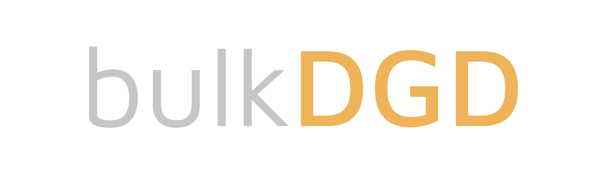

<h1 align="center">

</h1> 

bulkDGD is a Python package providing an interface to use the Deep Generative Decoder (DGD) developed by Schuster and Krogh (Schuster and Krogh, 2023) to model the gene expression of healthy human tissues from bulk RNA-Seq data.

The first application of the model to bulk RNA-Seq data is presented in the work of Prada-Luengo, Schuster, Liang, and coworkers (Prada-Luego, Schuster, Liang, et al., 2023).

* **Documentation**
  * bulkDGD's documentation for the latest version (which can be under development) can be found [here](https://bulkdgd.readthedocs.io/en/latest/).
  * bulkDGD's documentation for the latest stable version can be found [here](https://bulkdgd.readthedocs.io/en/stable/).

* **Bug reports**: please report any bugs or problems you encounter with bulkDGD in the dedicated [issues](https://github.com/Center-for-Health-Data-Science/bulkDGD/issues) section on GitHub.

**License**

bulkDGD is freely available under the terms of the GNU General Public License (Version 3, 29 June 2007).

**References**

(Schuster and Krogh, 2023) Schuster, Viktoria, and Anders Krogh. "The Deep Generative Decoder: MAP estimation of representations improves modelling of single-cell RNA data." *Bioinformatics* 39.9 (2023): btad497.

(Prada-Luengo, Schuster, Liang, et al., 2023) Prada-Luengo, Iñigo, et al. "N-of-one differential gene expression without control samples using a deep generative model." *Genome Biology* 24.1 (2023): 263.
